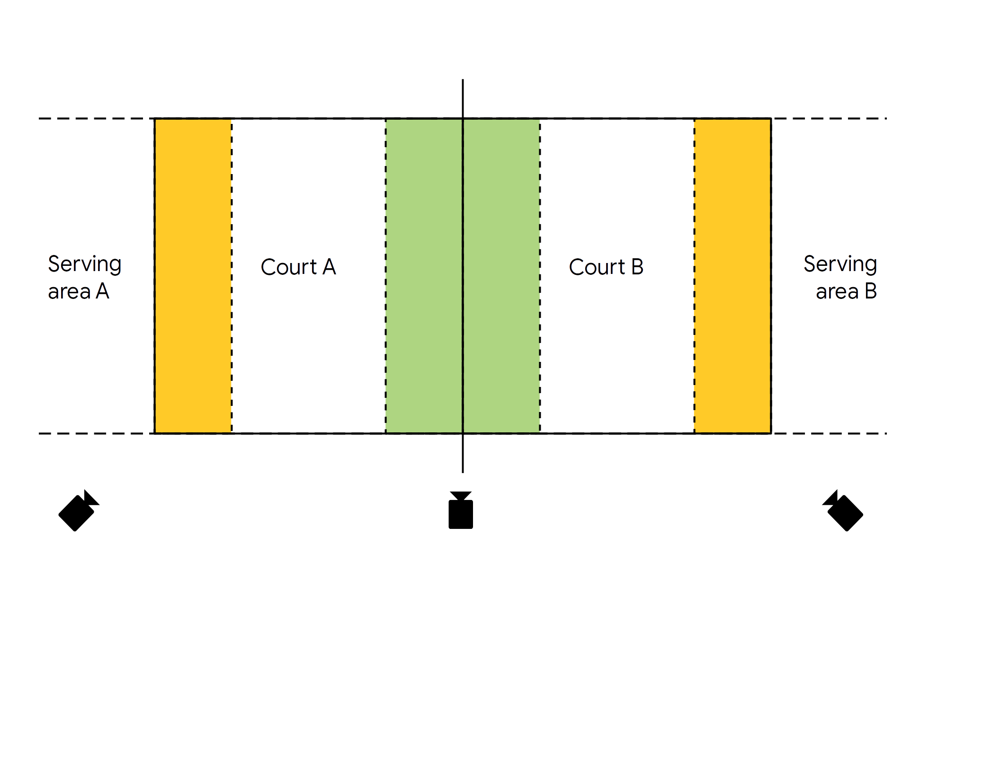
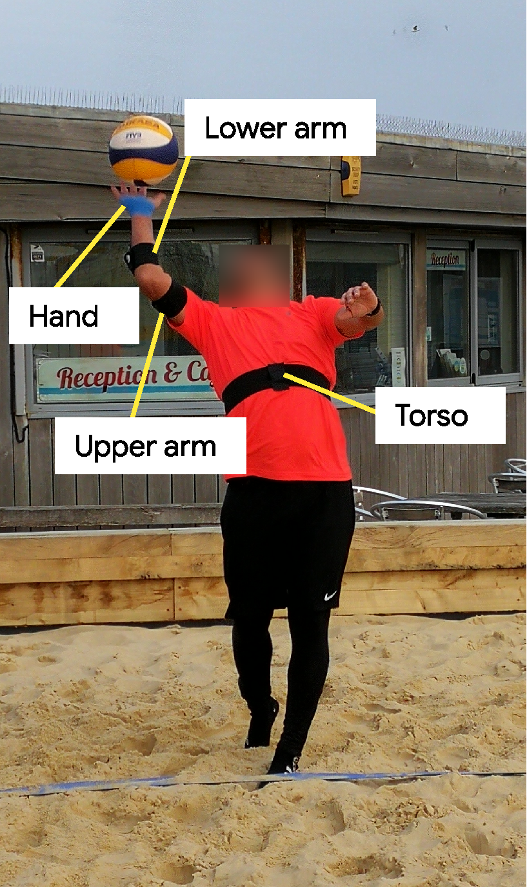

# Wearlab BeachVolleyball Dataset

This dataset was collected in 3 session, by 10 users. 2 users were presents in 2 sessions.
Therefore, the dataset contains 12 files. Here a summary of the dataset, per user.

## Data collection

### Court setup

### Sensors setup

### Dataset summary

| Session | user_ID | actual_ID | gender | hand | lf   | lts  | sf   | sts  | errors | sensors |
| ------- | ------- | --------- | ------ | ---- | ---- | ---- | ---- | ---- | ------ | ------- |
| 1       | 101     | 01        | F      | R    | 16   | 12   | 11   | 9    | 6      | -ul-    |
| 1       | 102     | 02        | M      | L    | 12   | 10   | 16   | 15   | 5      | tulh    |
| 1       | 103     | 03        | M      | R    | 8    | 13   | 14   | 12   | 2      | tulh    |
| 1       | 104     | 04        | F      | R    | 13   | 12   | 13   | 14   | 2      | tulh    |
| 2       | 201     | 05        | M      | R    | 12   | 11   | 12   | 13   | 2      | tulh    |
| 2       | 202     | 06        | M      | R    | 12   | 12   | 12   | 13   | 2      | tulh    |
| 2       | 203     | 07        | M      | R    | 11   | 10   | 12   | 11   | 2      | tulh    |
| 2       | 204     | 08        | F      | R    | 12   | 12   | 12   | 11   | 0      | tulh    |
| 3       | 301     | 01        | F      | R    | 13   | 12   | 14   | 12   | 0      | tulh    |
| 3       | 302     | 09        | F      | R    | 12   | 12   | 13   | 11   | 0      | tulh    |
| 3       | 303     | 10        | F      | R    | 14   | 12   | 14   | 11   | 0      | tulh    |
| 3       | 304     | 03        | F      | R    | 12   | 12   | 12   | 11   | 0      | tulh    |

- session : recording session. Each session was on a different day, and different conditions.
- user_ID : user ID as used in the name of the files
- actual_u : user ID identifing the real different users. User 101 and 301 are the same user, in different session. The same happened for user 103 and 304.
- lf: Long float serve
- lts: Long top spin serve
- sf: Short float serve
- sts: Short top spin serve
- errors: As the users were asked to perform 12 of each serve, following a specific order, the number of error is the number of serves performed at the wrong 

